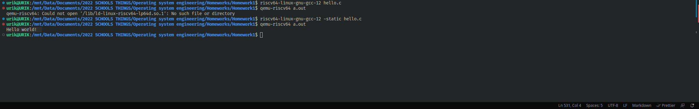

# Note 3-1

```
练习 3-1
使用 gcc 编译代码并使用 binutils 工具对生成的目标文件和可执行文件（ELF 格式）进行分析。具体要求如下：
编写一个简单的打印 “hello world！” 的程序源文件：hello.c
对源文件进行本地编译，生成针对支持 x86_64 指令集架构处理器的目标文件 hello.o。
查看 hello.o 的文件的文件头信息。
查看 hello.o 的 Section header table。
对 hello.o 反汇编，并查看 hello.c 的 C 程序源码和机器指令的对应关系。
```

## Compile hello.c

[hello.c](./hello.c) --> [hello.i](./hello.i) --> [hello.s](./hello.s) --> [hello.o](./hello.o)

[gcc informations](https://gcc.gnu.org/onlinedocs/gcc-12.2.0/gcc/Overall-Options.html#Overall-Options)

<details><summary>gcc -E hello.c -o hello.i</summary>

```
-E
Stop after the preprocessing stage; do not run the compiler proper. The output is in the form of reprocessed source code, which is sent to the standard output.

Input files that don’t require preprocessing are ignored.
```

</details>

<details><summary>gcc -S hello.i -o hello.s</summary>

```
-S
Stop after the stage of compilation proper; do not assemble. The output is in the form of an assembler code file for each non-assembler input file specified.

By default, the assembler file name for a source file is made by replacing the suffix ‘.c’, ‘.i’, etc., with ‘.s’.

Input files that don’t require compilation are ignored.
```

</details>

<details><summary>gcc -c hello.s -o hello.o</summary>

```
-c
Compile or assemble the source files, but do not link. The linking stage simply is not done. The ltimate output is in the form of an object file for each source file.

By default, the object file name for a source file is made by replacing the suffix ‘.c’, ‘.i’, ‘.s’, etc., with ‘.o’.

Unrecognized input files, not requiring compilation or assembly, are ignored.
```

</details>

## View hello.o file headers

[object dump informations](https://sourceware.org/binutils/docs/binutils/objdump.html)

[readelf informations](https://man7.org/linux/man-pages/man1/readelf.1.html)

<details><summary>objdump -f hello.o</summary>

```
-f
--file-headers
Display summary information from the overall header of each of the objfile files.
```

</details>

```
hello.o:     file format elf64-x86-64
architecture: i386:x86-64, flags 0x00000011:
HAS_RELOC, HAS_SYMS
start address 0x0000000000000000
```

> file format elf64-x86-64 : Executable Linkable Format, the 64-bit version of the x86 instruction set

> architecture: i386:x86-64 : 32-bit Intel Architecture, with AMD extension added to i386 to make it capable of executing 64-bit code

> flags 0x00000011:HAS_RELOC, HAS_SYMS : BFD(Binary File Descriptor library)-specific bitmasks, contains relocation entries & has symbols

> start address 0x0000000000000000 : The start address of the .text segment, containing all the executable code

<details><summary>readelf -h hello.o</summary>

```
-h
--file-header
Displays the information contained in the ELF header at the start of the file.
```

</details>

```
ELF Header:
  Magic:   7f 45 4c 46 02 01 01 00 00 00 00 00 00 00 00 00 
  Class:                             ELF64
  Data:                              2's complement, little endian
  Version:                           1 (current)
  OS/ABI:                            UNIX - System V
  ABI Version:                       0
  Type:                              REL (Relocatable file)
  Machine:                           Advanced Micro Devices X86-64
  Version:                           0x1
  Entry point address:               0x0
  Start of program headers:          0 (bytes into file)
  Start of section headers:          536 (bytes into file)
  Flags:                             0x0
  Size of this header:               64 (bytes)
  Size of program headers:           0 (bytes)
  Number of program headers:         0
  Size of section headers:           64 (bytes)
  Number of section headers:         13
  Section header string table index: 12
```

> Magic : in /usr/include/elf.h

```c
#define ELFMAG0		0x7f		/* Magic number byte 0 */
#define ELFMAG1		'E'		/* Magic number byte 1 */    # 0x45 == (char)69 == 'E'
#define ELFMAG2		'L'		/* Magic number byte 2 */    # 0x4c == (char)76 == 'L'
#define ELFMAG3		'F'		/* Magic number byte 3 */    # 0x46 == (char)70 == 'F'
#define ELFCLASS64	2		/* 64-bit objects */
#define ELFDATA2LSB	1		/* 2's complement, little endian */
#define EI_VERSION	6		/* File version byte index */    # ELF version == 1
#define ELFOSABI_NONE		0	/* UNIX System V ABI */
#define EI_ABIVERSION	8		/* ABI version */    # not set == 0
#define EI_PAD		9		/* Byte index of padding bytes */
```

## View hello.o section headers

<details><summary>objdump -h hello.o</summary>

```
-h
--section-headers
--headers
Display summary information from the section headers of the object file.

File segments may be relocated to nonstandard addresses, for example by using the -Ttext, -Tdata, or -Tbss options to ld. However, some object file formats, such as a.out, do not store the starting address of the file segments. In those situations, although ld relocates the sections correctly, using ‘objdump -h’ to list the file section headers cannot show the correct addresses. Instead, it shows the usual addresses, which are implicit for the target.

Note, in some cases it is possible for a section to have both the READONLY and the NOREAD attributes set. In such cases the NOREAD attribute takes precedence, but objdump will report both since the exact setting of the flag bits might be important.
```

</details>

```
hello.o:     file format elf64-x86-64

Sections:
Idx Name          Size      VMA               LMA               File off  Algn
  0 .text         00000016  0000000000000000  0000000000000000  00000040  2**0
                  CONTENTS, ALLOC, LOAD, RELOC, READONLY, CODE
  1 .data         00000000  0000000000000000  0000000000000000  00000056  2**0
                  CONTENTS, ALLOC, LOAD, DATA
  2 .bss          00000000  0000000000000000  0000000000000000  00000056  2**0
                  ALLOC
  3 .rodata       0000000d  0000000000000000  0000000000000000  00000056  2**0
                  CONTENTS, ALLOC, LOAD, READONLY, DATA
  4 .comment      0000001f  0000000000000000  0000000000000000  00000063  2**0
                  CONTENTS, READONLY
  5 .note.GNU-stack 00000000  0000000000000000  0000000000000000  00000082  2**0
                  CONTENTS, READONLY
  6 .eh_frame     00000038  0000000000000000  0000000000000000  00000088  2**3
                  CONTENTS, ALLOC, LOAD, RELOC, READONLY, DATA
```

> .text : Segment contains executable instructions

> .data : Segment contains the global variables and static variables that are initialized (Note: The overall variable initially reduced to 0 is still kept in the BSS segment)

> .bss : Segment contains all global and static variables that do not have explicit initialization

> .rodata : Segment contains constant data, such as the overall variable defined as constant in the program, the constant defined by #define, and the string constant

> .comment : Segment contains comments about the generated ELF (details such as compiler version and execution platform)

> LMA (load memory address): an address stored in a program area

> VMA(virtual memory address): the address of the program section during execution


<details><summary>readelf -S hello.o</summary>

```
-S
--sections
--section-headers
Displays the information contained in the file's section headers, if it has any.
```

</details>

```
There are 13 section headers, starting at offset 0x218:

Section Headers:
  [Nr] Name              Type             Address           Offset
       Size              EntSize          Flags  Link  Info  Align
  [ 0]                   NULL             0000000000000000  00000000
       0000000000000000  0000000000000000           0     0     0
  [ 1] .text             PROGBITS         0000000000000000  00000040
       0000000000000016  0000000000000000  AX       0     0     1
  [ 2] .rela.text        RELA             0000000000000000  00000168
       0000000000000030  0000000000000018   I      10     1     8
  [ 3] .data             PROGBITS         0000000000000000  00000056
       0000000000000000  0000000000000000  WA       0     0     1
  [ 4] .bss              NOBITS           0000000000000000  00000056
       0000000000000000  0000000000000000  WA       0     0     1
  [ 5] .rodata           PROGBITS         0000000000000000  00000056
       000000000000000d  0000000000000000   A       0     0     1
  [ 6] .comment          PROGBITS         0000000000000000  00000063
       000000000000001f  0000000000000001  MS       0     0     1
  [ 7] .note.GNU-stack   PROGBITS         0000000000000000  00000082
       0000000000000000  0000000000000000           0     0     1
  [ 8] .eh_frame         PROGBITS         0000000000000000  00000088
       0000000000000038  0000000000000000   A       0     0     8
  [ 9] .rela.eh_frame    RELA             0000000000000000  00000198
       0000000000000018  0000000000000018   I      10     8     8
  [10] .symtab           SYMTAB           0000000000000000  000000c0
       0000000000000090  0000000000000018          11     4     8
  [11] .strtab           STRTAB           0000000000000000  00000150
       0000000000000013  0000000000000000           0     0     1
  [12] .shstrtab         STRTAB           0000000000000000  000001b0
       0000000000000061  0000000000000000           0     0     1
Key to Flags:
  W (write), A (alloc), X (execute), M (merge), S (strings), I (info),
  L (link order), O (extra OS processing required), G (group), T (TLS),
  C (compressed), x (unknown), o (OS specific), E (exclude),
  D (mbind), l (large), p (processor specific)
```

> in /usr/include/elf.h

```c
typedef struct
{
  Elf64_Word	sh_name;		/* Section name (string tbl index) */
  Elf64_Word	sh_type;		/* Section type */
  Elf64_Xword	sh_flags;		/* Section flags */
  Elf64_Addr	sh_addr;		/* Section virtual addr at execution */
  Elf64_Off	sh_offset;		/* Section file offset */
  Elf64_Xword	sh_size;		/* Section size in bytes */
  Elf64_Word	sh_link;		/* Link to another section */
  Elf64_Word	sh_info;		/* Additional section information */
  Elf64_Xword	sh_addralign;		/* Section alignment */
  Elf64_Xword	sh_entsize;		/* Entry size if section holds table */
} Elf64_Shdr;
```

## Disassemble hello.o

[x86 Assembly](https://flint.cs.yale.edu/cs421/papers/x86-asm/asm.html)

<details><summary>objdump -d hello.o</summary>

```
-d
--disassemble
--disassemble=symbol
Display the assembler mnemonics for the machine instructions from the input file. This option only disassembles those sections which are expected to contain instructions. If the optional symbol argument is given, then display the assembler mnemonics starting at symbol. If symbol is a function name then disassembly will stop at the end of the function, otherwise it will stop when the next symbol is encountered. If there are no matches for symbol then nothing will be displayed.

Note if the --dwarf=follow-links option is enabled then any symbol tables in linked debug info files will be read in and used when disassembling.
```

</details>

```
hello.o:     file format elf64-x86-64


Disassembly of section .text:

0000000000000000 <main>:
   0:   55                      push   %rbp
   1:   48 89 e5                mov    %rsp,%rbp
   4:   48 8d 05 00 00 00 00    lea    0x0(%rip),%rax        # b <main+0xb>
   b:   48 89 c7                mov    %rax,%rdi
   e:   e8 00 00 00 00          call   13 <main+0x13>
  13:   90                      nop
  14:   5d                      pop    %rbp
  15:   c3                      ret
```

> %rbp : Base pointer, pointing to the bottom of the stack

> %rsp : Stack pointer, pointing to the top of stack

> %rip : Instruction pointer (pc), used to record the next instruction to be executed

> %rax : Accumulator register

> %rdi : Destination index register

>     0000000000000000 <main>: --> Memory address of main
> 
>        0: --> Memory displacement of the instruction
> 
>           55 --> Machine code of the instruction
> 
>                                   push   %rbp --> Assembly code of the instruction

```s
push   %rbp             # Push the old base pointer onto the stack to save it for later
mov    %rsp,%rbp        # Copy the value of the stack pointer to the base pointer
lea    0x0(%rip),%rax   # Assign address (%rip)+0x0 to %rax
mov    %rax,%rdi        # Copy the value of %rax to the destination index register
call   13 <main+0x13>   # pushes %rip to stack, and jump to 13 <main+0x13>
nop                     # No operation
pop    %rbp             # pop the top element of the stack into %rbp
ret                     # Pop the top element of the stack into %rip, and jump
```

# Note 3-2

```c
练习 3-2
如下例子 C 语言代码：

#include <stdio.h> 
 
int global_init = 0x11111111; 
const int global_const = 0x22222222; 
 
void main() 
{ 
        static int static_var = 0x33333333; 
        static int static_var_uninit; 
 
        int auto_var = 0x44444444; 
 
        printf("hello world!\n"); 
        return; 
} 

请问编译为 .o 文件后，global_init, global_const, static_var, static_var_uninit, auto_var 这些变量分别存放在那些 section 里，"hello world!\n" 这个字符串又在哪里？并尝试用工具查看并验证你的猜测。
```

[hello2.c](hello2.c) --> [hello2.o](hello2.o)

[section header](#view-helloo-section-headers)

global_init : stored in .data

global_const : stored in .rodata

static_var : stored in .data

static_var_uninit : stored in .bss

auto_var : stored in .text

string "hello world!\n" : stored in .rodata

<details><summary>objdump -s hello2.o</summary>

```
-s
--full-contents
Display the full contents of any sections requested. By default all non-empty sections are displayed.
```

</details>


```
......

Contents of section .text:
 1050 31ed4989 d15e4889 e24883e4 f0505445  1.I..^H..H...PTE
 1060 31c031c9 488d3dce 000000ff 154f2f00  1.1.H.=......O/.
 1070 00f4662e 0f1f8400 00000000 0f1f4000  ..f...........@.
 1080 488d3d99 2f000048 8d05922f 00004839  H.=./..H.../..H9
 1090 f8741548 8b052e2f 00004885 c07409ff  .t.H.../..H..t..
 10a0 e00f1f80 00000000 c30f1f80 00000000  ................
 10b0 488d3d69 2f000048 8d35622f 00004829  H.=i/..H.5b/..H)
 10c0 fe4889f0 48c1ee3f 48c1f803 4801c648  .H..H..?H...H..H
 10d0 d1fe7414 488b05fd 2e000048 85c07408  ..t.H......H..t.
 10e0 ffe0660f 1f440000 c30f1f80 00000000  ..f..D..........
 10f0 f30f1efa 803d252f 00000075 2b554883  .....=%/...u+UH.
 1100 3dda2e00 00004889 e5740c48 8b3dfe2e  =.....H..t.H.=..
 1110 0000e829 ffffffe8 64ffffff c605fd2e  ...)....d.......
 1120 0000015d c30f1f00 c30f1f80 00000000  ...]............
 1130 f30f1efa e977ffff ff554889 e54883ec  .....w...UH..H..
 1140 10c745fc 44444444 488d05b9 0e000048  ..E.DDDDH......H
 1150 89c7e8d9 feffff90 c9c3               ..........      

......

Contents of section .rodata:
 2000 01000200 22222222 68656c6c 6f20776f  ....""""hello wo
 2010 726c6421 00                          rld!.           

......

Contents of section .data:
 4008 00000000 00000000 10400000 00000000  .........@......
 4018 11111111 33333333                    ....3333        
Contents of section .comment:
 0000 4743433a 20284465 6269616e 2031322e  GCC: (Debian 12.
 0010 322e302d 33292031 322e322e 3000      2.0-3) 12.2.0.  
```

# Note 4-1

```
练习 4-1
熟悉交叉编译概念，使用 riscv gcc 编译代码并使用 binutils 工具对生成的目标文件和可执行文件（ELF 格式）
进行分析。具体要求如下：
编写一个简单的打印 “hello world！” 的程序源文件：hello.c
对源文件进行编译，生成针对支持 rv32ima 指令集架构处理器的目标文件 hello.o。
查看 hello.o 的文件的文件头信息。
查看 hello.o 的 Section header table。
对 hello.o 反汇编，并查看 hello.c 的 C 程序源码和机器指令的对应关系。
```

## Compile hello.c by riscv64-linux-gnu-gcc-12

[hello.c](hello.c) --> [hello3.o](hello3.o)

tools :

```
gcc-12-riscv64-linux-gnu 12.2.0-9cross1 [Debian/bookworm main]
├── is installed
└── GNU C compiler (cross compiler for riscv64 architecture)
```

riscv64-linux-gnu-gcc-12 -E hello.c -o hello3.i

riscv64-linux-gnu-gcc-12 -S hello3.i -o hello3.s

riscv64-linux-gnu-gcc-12 -c hello3.s -o hello3.o

or

riscv64-linux-gnu-gcc-12 -c hello.c -o hello3.o

## View hello3.o file headers

riscv64-linux-gnu-objdump -f hello3.o

```
hello3.o:     file format elf64-littleriscv
architecture: riscv:rv64, flags 0x00000011:
HAS_RELOC, HAS_SYMS
start address 0x0000000000000000
```

## View hello3.o section headers

riscv64-linux-gnu-objdump -h hello3.o

```
hello3.o:     file format elf64-littleriscv

Sections:
Idx Name          Size      VMA               LMA               File off  Algn
  0 .text         00000022  0000000000000000  0000000000000000  00000040  2**1
                  CONTENTS, ALLOC, LOAD, RELOC, READONLY, CODE
  1 .data         00000000  0000000000000000  0000000000000000  00000062  2**0
                  CONTENTS, ALLOC, LOAD, DATA
  2 .bss          00000000  0000000000000000  0000000000000000  00000062  2**0
                  ALLOC
  3 .rodata       0000000d  0000000000000000  0000000000000000  00000068  2**3
                  CONTENTS, ALLOC, LOAD, READONLY, DATA
  4 .comment      0000001f  0000000000000000  0000000000000000  00000075  2**0
                  CONTENTS, READONLY
  5 .note.GNU-stack 00000000  0000000000000000  0000000000000000  00000094  2**0
                  CONTENTS, READONLY
  6 .riscv.attributes 00000053  0000000000000000  0000000000000000  00000094  2**0
                  CONTENTS, READONLY
```

## Disassemble hello3.o

riscv64-linux-gnu-objdump -d hello3.o

```
hello3.o:     file format elf64-littleriscv


Disassembly of section .text:

0000000000000000 <main>:
   0:   1141                    add     sp,sp,-16
   2:   e406                    sd      ra,8(sp)
   4:   e022                    sd      s0,0(sp)
   6:   0800                    add     s0,sp,16
   8:   00000517                auipc   a0,0x0
   c:   00050513                mv      a0,a0
  10:   00000097                auipc   ra,0x0
  14:   000080e7                jalr    ra # 10 <main+0x10>
  18:   0001                    nop
  1a:   60a2                    ld      ra,8(sp)
  1c:   6402                    ld      s0,0(sp)
  1e:   0141                    add     sp,sp,16
  20:   8082                    ret
```

# Note 4-2

```
练习 4-2
基于 练习 4-1 继续熟悉 qemu/gdb 等工具的使用，具体要求如下：
将 hello.c 编译成可调式版本的可执行程序 a.out
先执行 qemu-riscv32 运行 a.out。
使用 qemu-riscv32 和 gdb 调试 a.out。
```

[hello.c](hello.c) --> [a.out](a.out)

[gcc link options](https://gcc.gnu.org/onlinedocs/gcc-12.2.0/gcc/Link-Options.html#Link-Options)

<details><summary>riscv64-linux-gnu-gcc-12 -static hello.c</summary>

```
-static
On systems that support dynamic linking, this overrides -pie and prevents linking with the shared libraries. On other systems, this option has no effect.
```

</details>

[QEMU options](https://www.qemu.org/docs/master/system/invocation.html#hxtool-9)

qemu-riscv64 a.out

```
Hello world!
```



# Note 4-3

```
练习 4-3
自学 Makefile 的语法，理解在 riscv-operating-system-mooc 仓库的根目录下执行 make 会发生什么。
```

[GNU make manual](https://www.gnu.org/software/make/manual/html_node/index.html)

## riscv-operating-system-mooc-main/Makefile

Related to riscv-operating-system-mooc-main/[code/asm/Makefile](#codeasmmakefile)

& riscv-operating-system-mooc-main/[code/os/Makefile](#codeosmakefile)

```Makefile
SECTIONS = \
	code/asm \
	code/os \

.DEFAULT_GOAL := all
all :
	@echo "begin compile ALL exercises for assembly samples ......................."
	for dir in $(SECTIONS); do $(MAKE) -C $$dir || exit "$$?"; done
	@echo "compile ALL exercises finished successfully! ......"

.PHONY : clean
clean:
	for dir in $(SECTIONS); do $(MAKE) -C $$dir clean || exit "$$?"; done

.PHONY : slides
slides:
	rm -f ./slides/*.pdf
	soffice --headless --convert-to pdf:writer_pdf_Export --outdir ./slides ./docs/ppts/*.pptx
```

psudo code :

```
SECTIONS = ["code/asm", "code/os"]
MAKE = make

if all is not complete:
     for dir in $SECTIONS:
          do $MAKE --directory=$dir
          or do exit "$?"
```

---

### code/common.mk

Defined parameter flags

```Makefile
CROSS_COMPILE = riscv64-unknown-elf-
CFLAGS = -nostdlib -fno-builtin -march=rv32ima -mabi=ilp32 -g -Wall

QEMU = qemu-system-riscv32
QFLAGS = -nographic -smp 1 -machine virt -bios none

GDB = gdb-multiarch
CC = ${CROSS_COMPILE}gcc
OBJCOPY = ${CROSS_COMPILE}objcopy
OBJDUMP = ${CROSS_COMPILE}objdump
```

---

### code/asm/build.mk

Included [code/asm/rule.mk](#codeasmrulemk), and related to [code/asm/gdbinit](#codeasmgdbinit)

```Makefile
EXEC = test

SRC = ${EXEC}.s

GDBINIT = ../gdbinit

include ../rule.mk
```

---

### code/asm/gdbinit

```
display/z $x5
display/z $x6
display/z $x7

set disassemble-next-line on
b _start
target remote : 1234
c
```

---

### code/asm/Makefile

Related to each Makefile in all the folders at code/asm

for example, to [code/asm/_first/Makefile](#codeasm_firstmakefile)

---

### code/asm/rule.mk

Included [code/common.mk](#codecommonmk)

```Makefile
include ../../common.mk

.DEFAULT_GOAL := all
all:
	@${CC} ${CFLAGS} ${SRC} -Ttext=0x80000000 -o ${EXEC}.elf
	@${OBJCOPY} -O binary ${EXEC}.elf ${EXEC}.bin
```

---

### code/asm/_first/Makefile

Call [asm/build.mk](#codeasmbuildmk)

---

### code/os/Makefile

Related to each Makefile in all the folders at code/os

for example, to [code/os/00-bootstrap/Makefile](#codeos00-bootstrapmakefile)

---

### code/os/00-bootstrap/Makefile

Included [code/common.mk](#codecommonmk)

```Makefile
include ../../common.mk

SRCS_ASM = \
	start.S \

SRCS_C = \
	kernel.c \

OBJS = $(SRCS_ASM:.S=.o)
OBJS += $(SRCS_C:.c=.o)

.DEFAULT_GOAL := all
all: os.elf

# start.o must be the first in dependency!
os.elf: ${OBJS}
	${CC} ${CFLAGS} -Ttext=0x80000000 -o os.elf $^
	${OBJCOPY} -O binary os.elf os.bin
```